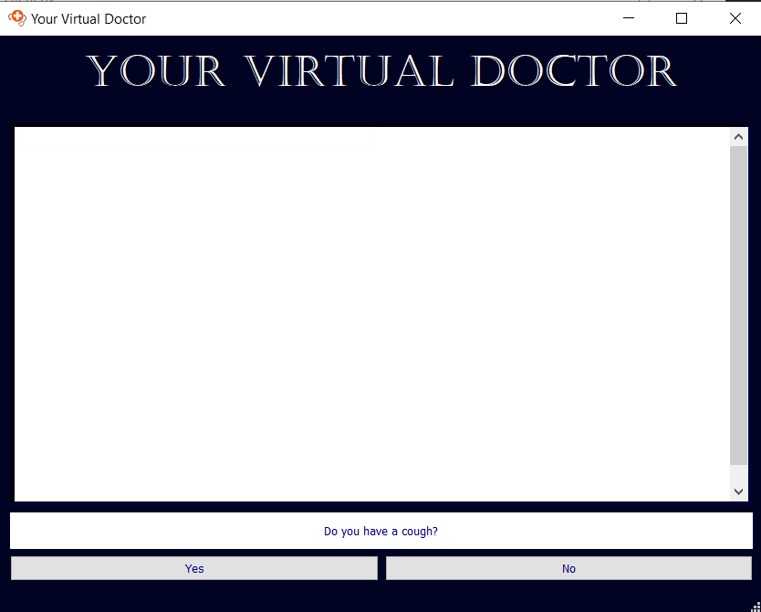
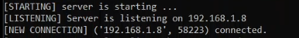
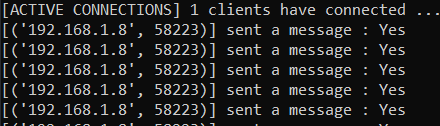
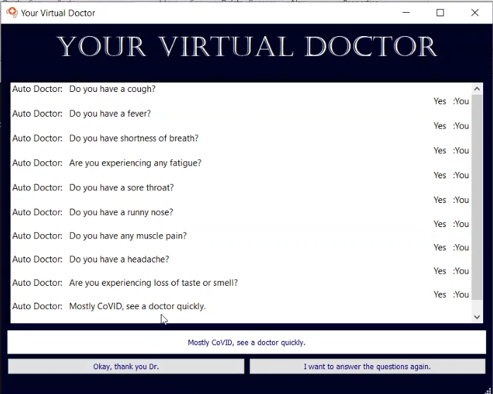
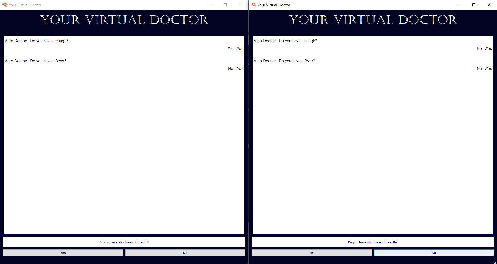
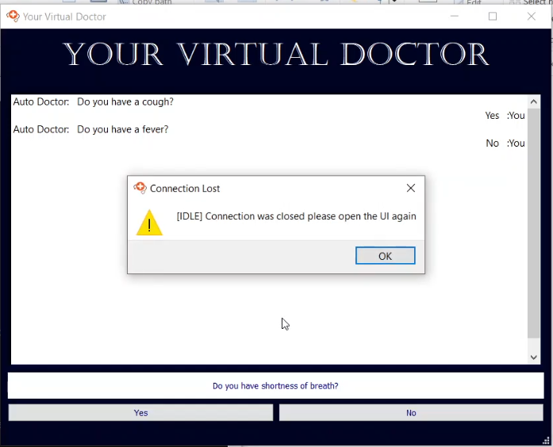
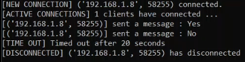
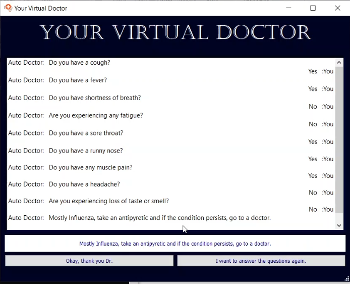
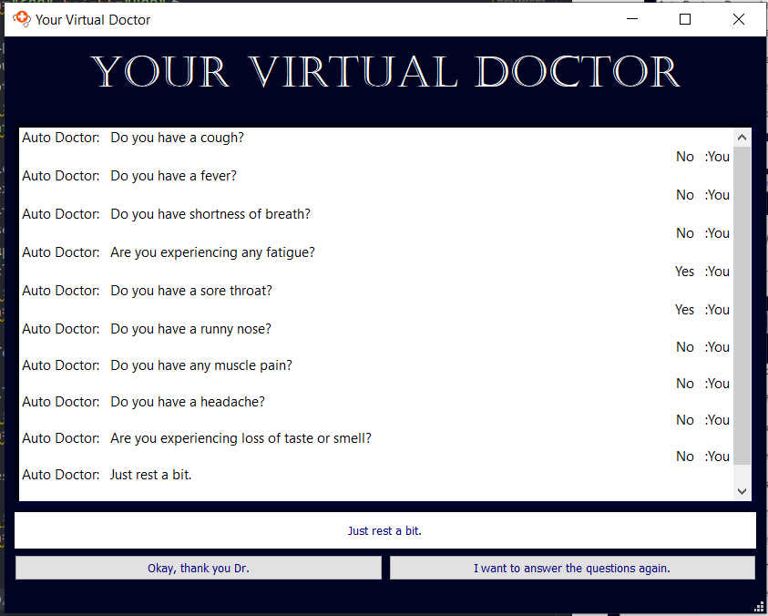
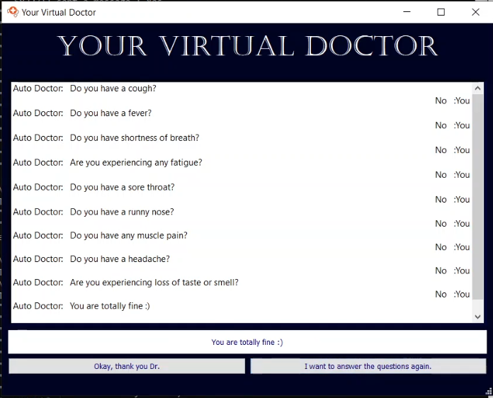

# SBE 404A - Networking Project

## Medical Chat Bot - Your Virtual Doctor

**Submitted to: Dr. Ahmed Morsy, Dr. Eman N. Marzban and Eng. Alaa Melek**

Submitted by:

|              Name              | Section | B.N. |
|:------------------------------:|:-------:|:----:|
|   Ahmed Khaled Mohamed Salah   |    1    |   4  |
|   Alaa Gamal Abdelaziz Saber   |    1    |  15  |
| Bassam Mustafa Mahmoud Mohamed |    1    |  22  |

Video: [Link Here](https://drive.google.com/file/d/1WmV16r5RH3QmgqwSAt7Abuq6hu1MzDpV/view?usp=sharing)

In this project we built a "Medical Chat Bot". It asks the user 9 questions about symptoms he/she may have, the user answers using 2 button Yes/No. The GUI was built using `PyQt5`.

We built a server using `socket` library in Python that allowed us to generate communication with the clients using TCP/IP connection. The GUI and the server handle the connections properly and handled.

When a question is answered, the message is sent from the client to the server using that communication and processed at the server until all answers are collected.

When all answers are collected, a decision tree model, which we built ourselves, is run with the input of the processed answers, it responds with a message that tells the possibility of an illness and a recommendation to see a doctor, take a medication, take some rest, etc.

Multiple clients can access to the server, each client has its own thread (connection) and it's totally independent of the other clients' connections to the server.

A client's connection is timeout enabled, which means if the server didn't get a response from you "the client" for a specified time, which is specified in our case 20 seconds, the server closes the connection with that client and a pop-up message appears telling the user that the connection was closed as he/she was IDLE.

### Testing

1. All answers "Yes"

2. Yes/Yes/No/No/Yes/Yes/Yes/No/No

3. No/No/No/Yes/Yes/No/No/No/No

4. All answers "No"

